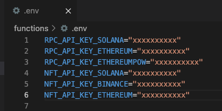

## WandyApi Backend

1. **API List**  
<pre>
  (1) createWallet(String mnemonic)  
  (2) getBalance(String walletAddress, String tokenAddress)  
  (3) transfer(String mnemonic, String tokenAddress, double amount, String toAddress)  
  (4) getNFTsByOwner(String walletAddress)  
  (5) transferNFT(String mnemonic, String tokenAddress, String tokenId, double amount, String toAddress)  
  (6) getEstimateGasFee(String fromAddress, String tokenAddress, double amount, String toAddress)</pre>

2. **firebase** - Build Node.js api on Google firebase cloud.  
   Important: Please create a config file **$\color[RGB]{255,66,66}.env$** in firebase/functions  
   <pre>RPC_API_KEY_SOLANA="xxxxxxxxxx"  
   RPC_API_KEY_ETHEREUM="xxxxxxxxxx"  
   RPC_API_KEY_ETHEREUMPOW="xxxxxxxxxx"  
   NFT_API_KEY_SOLANA="xxxxxxxxxx"  
   NFT_API_KEY_BINANCE="xxxxxxxxxx"  
   NFT_API_KEY_ETHEREUM="xxxxxxxxxx"</pre>  
   
   
  
3. **aws** - Build api on aws or your own cloud.  
  aws supports more apis, coming soon ...
    
  You can choose $\color[RGB]{255,66,66} One Of Them$ to be your own backend.   
  Each one has the capacity to handle millions of users.

4. **Unit Test**  
  Test web3 functions without installing the firebase backend, here are the testing samples of Ethereum:  
  - get the balance of SHIBA token  
  - transfer 1000 SHIBA token to a wallet
  <pre>
  node version : v16.18.0, please install all the modules for ethereum.js:
  WandyApi@BlackCat-MBP functions % node i web3
  WandyApi@BlackCat-MBP functions % node i bip39
  WandyApi@BlackCat-MBP functions % node i ethereumjs-wallet
  WandyApi@BlackCat-MBP functions % node i bignumber.js
  WandyApi@BlackCat-MBP functions % node i node-fetch
  WandyApi@BlackCat-MBP functions % node i dotenv
</pre>
  <pre>
  
  Update ethereum.js:
  
  async function getBalance(walletAddress, tokenAddress){  
  // exports.getBalance = async (req, res) => {
  //     let walletAddress = req.walletAddress;
  //     let tokenAddress = req.tokenAddress;
  ...  
  async function transfer(mnemonic, tokenAddress, toAddress, amount){   
  // exports.transfer = async (req, res) => {
    // var mnemonic = req.mnemonic;
    // var toAddress = req.toAddress;
    // const tokenAddress = req.tokenAddress;
    // const amount = Number(req.amount);
   ...  
   // Unit Test
// SHIBA Token https://etherscan.io/token/0x95aD61b0a150d79219dCF64E1E6Cc01f0B64C4cE
getBalance('0x057Fc44D60F1D31F3401d9B2739C7F37365A2689', '0x95aD61b0a150d79219dCF64E1E6Cc01f0B64C4cE').then(
   (data) => {
     console.log(data);
   }
 );

// Please fill the mnemonic
transfer('mnemonic', '0x95aD61b0a150d79219dCF64E1E6Cc01f0B64C4cE', '0x5025b56d1f527EDaF39708B149A4FA322EA475eE', 1000 * 1000000000000000000.00).then(
   (data) => {
     console.log(data);
   }
 );
</pre>
<pre>
WandyApi@BlackCat-MBP functions % node ethereum.js
{
  "error": "",
  "walletAddress": "0x057Fc44D60F1D31F3401d9B2739C7F37365A2689",
  "tokenAddress": "0x95aD61b0a150d79219dCF64E1E6Cc01f0B64C4cE",
  "balance": "10000000000000000090000"
}
{
  "error": "",
  "transactionHash": "0x407c7fb1b4acbea48cceb749f2834b95441b25a40ec0e28119e1b6bad345cada",
  "tokenAddress": "0x95aD61b0a150d79219dCF64E1E6Cc01f0B64C4cE",
  "fromAddress": "0x057fc44d60f1d31f3401d9b2739c7f37365a2689",
  "toAddress": "0x5025b56d1f527EDaF39708B149A4FA322EA475eE",
  "amount": 1e+21,
  "gasPrice": "13381473687",
  "gasUsed": 51871,
  "gasFee": 694110421618377
}
</pre>
Check Balance - https://etherscan.io/address/0x057fc44d60f1d31f3401d9b2739c7f37365a2689  
Check Transaction - https://etherscan.io/tx/0x407c7fb1b4acbea48cceb749f2834b95441b25a40ec0e28119e1b6bad345cada
  
5. **How to call api on firebase?**  
  Please check the demo codes.
   
6. **How to call api on aws?**  
  Coming soon ...

7. **How to install backend on firebase?**  
  https://firebase.google.com/docs/functions/get-started

8. **How to install backend on aws?**  
  Coming soon ...

9. **Seeds Phrase**  
  The Seeds Phrase is used to generate wallet address & make transfers of token and nft on the server-side.  
  We recommend using a Secret Manager to secure your Seeds Phrase or Private Key.  
  -- Google Cloud Secret Manager  
  -- AWS Secrets Manager  
  -- Doppler  
  -- HashiCorp Vault
