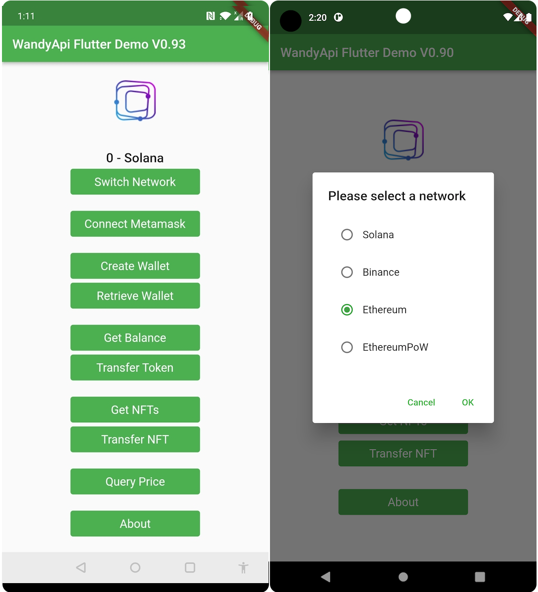

**Flutter Demo of WandyApi**
-- Support Android & iOS

**How to build and run flutter_demo**
1. Enviroments: Flutter 3.3.6 • Dart 2.18.2 • Android SDK 33  • Xcode 14.0.1
2. flutter pub get
3. flutter build apk --debug   (https://docs.flutter.dev/deployment/android)
4. pod install (in ios folder, if you want to build iOS app at the same time)
5. flutter build ios 
6. open ios/Runner.xcworkspace 
7. run in Xcode (https://docs.flutter.dev/deployment/ios)
8. 

**How to install Flutter**
1. Install Android Studio - https://developer.android.com/studio/install
2. Install Flutter SDK - https://docs.flutter.dev/get-started/install
3. Install Xcode - https://apps.apple.com/us/app/xcode/id497799835 (If you want to build iOS app at the same time)
